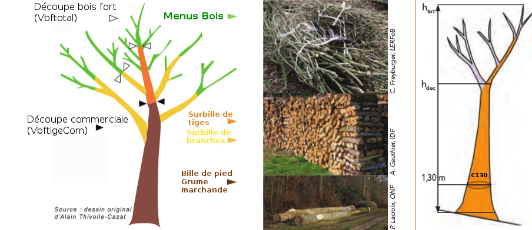

### Hauteur de décrochement (Hdec)
C'est la hauteur de la première **décroissance brutale (10%)** de la tige de l'arbre. Cette déformation puet être due à un redent, à l'insertion d'une grosse branche ou à la couronne du houppier. Si il n'existe pas de décroissance brutale marquée de la tige, Hdecrochement = Hdecoupe (7 cm bois fort : cas de nombreux résineux).

### Volume bois fort total découpe 7 cm (Vbftot7cm)
Pour toutes les essences, il s'agit du volume sur écorce des tiges **ET** des branches, des catégories 10 cm et plus de diamètre à 1,30 m arrêtées à la souche d'une part, et, à défaut de précision, à la découpe 7 cm de diamètre d'autre part. C'est le volume du pied de l'arbre jusqu'à la découpe 7 cm de l'axe principal **ET** les branches de l'arbre. Vbftot7cm = VbftigCom + VHouppiers [(ONF - Textes essentiels)](http://www.onf.fr/filiere_bois/sommaire/informations/textes_essentiels-2/20091222-095953-422463/@@index.html).

### Volume bois fort tige découpe 7 cm (Vbftig7cm)
Pour toutes les essences, il s'agit du volume sur écorce des tiges **SANS** les branches, des catégories 10 cm et plus de diamètre à 1,30 m arrêtées à la souche d'une part, et, à défaut de précision, à la découpe 7 cm de diamètre d'autre part. C'est le volume du pied de l'arbre jusqu'à la découpe 7 cm de l'axe principal **SANS** les branches de l'arbre [(ONF - Textes essentiels)](http://www.onf.fr/filiere_bois/sommaire/informations/textes_essentiels-2/20091222-095953-422463/@@index.html).

### Volume bois fort tige découpe commerciale (VbftigCom)
Pour les chênes et hêtres, il s'agit du volume sur écorce des tiges des catégories 30 cm et plus de diamètre à 1,30 m arrêtées à la souche d'une part, et, à défaut de précision, à la découpe 20 cm de diamètre d'autre part.
Pour les autres feuillus, il s'agit du volume sur écorce des tiges des catégories 25 cm et plus de diamètre à 1,30 m arrêtées à la souche d'une part, et, à défaut de précision, à la découpe 20 cm de diamètre d'autre part.
Pour les résineux, il s'agit du volume sur écorce des tiges des catégories 25 cm et plus de diamètre à 1,30 m arrêtées à la souche d'une part, et, à défaut de précision, à la découpe 14 cm de diamètre d'autre part, sauf pour les pins des catégories 35 cm et plus de diamètre à 1,30 m pour lesquels cette découpe est, à défaut de précision, portée à 20 cm de diamètre [(ONF - Textes essentiels)](http://www.onf.fr/filiere_bois/sommaire/informations/textes_essentiels-2/20091222-095953-422463/@@index.html).

### Volume houppier (VHouppiers)
Il s'agit du volume sur écorce (7 cm de diamètre fin bout) des branches et des parties des tiges situées au-dessus de la découpe où sont arrêtés les volumes tiges des arbres (VHouppiers = Vbftot7cm - VbftigCom) [(ONF - Textes essentiels)](http://www.onf.fr/filiere_bois/sommaire/informations/textes_essentiels-2/20091222-095953-422463/@@index.html).

### % Houppiers (PHouppiers)
Il s'agit de la proportion du volume bois fort tige découpe commerciale représentant le volume houppier dans le volume bois fort total (PHouppiers =  Vbftot7cm / VbftigCom - 1).

### Volume "perches et brins"
Il s'agit du volume sur écorce de la tige arrêtée à la souche, d'une part, et à la découpe de 7 cm de diamètre, d'autre part pour les chênes et les hêtres des catégories 25 cm et moins de diamètre à 1,30 m et pour toutes les autres essences (feuillues et résineuses) des catégories 20 cm et moins de diamètre à 1,30 m [(ONF - Textes essentiels)](http://www.onf.fr/filiere_bois/sommaire/informations/textes_essentiels-2/20091222-095953-422463/@@index.html).

### Volume "taillis"
Il s'agit du volume sur écorce (7 cm de diamètre fin bout) de l'ensemble des tiges, des perches et brins de taillis [(ONF - Textes essentiels)](http://www.onf.fr/filiere_bois/sommaire/informations/textes_essentiels-2/20091222-095953-422463/@@index.html).

### Résineux : pourcentage présumé d’écorce
Les fiches des articles mis en vente comportant des résineux de la classe "arbres" mentionnent, à titre indicatif, les volumes présumés sous écorce de ces bois [(ONF - Textes essentiels)](http://www.onf.fr/filiere_bois/sommaire/informations/textes_essentiels-2/20091222-095953-422463/@@index.html).
Coefficient d'écorce P permettant le passage du volume sur écorce au volume sous écorce : Volume sous écorce = Volume sur écorce x ( 1 – P )
Sauf précision contraire figurant au niveau de l'article, les coefficients d'écorce par essence sont les suivants :

|ESSENCE                                         |Coefficient d’écorce (P)   |
|------------------------------------------------|:-------------------------:|
|Epicéas – Sapins - Grandis                      |10%                        |
|Douglas                                         |13%                        |
|Pin Sylvestre – Pin Weymouth - Cèdre de l'Atlas |15%                        |
|Pin Laricio                                     |19%                        |
|Pin Noir                                        |20%                        |
|Mélèze – Pin Maritime                           |25%                        |

