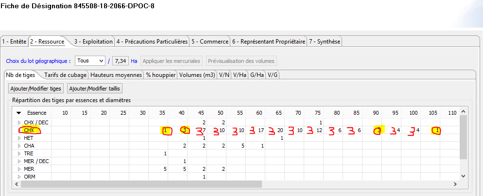

## Protocole pour le recueil de données dendrométriques dans les peuplements martelés pour déterminer le n° de barème de cubage de bois sur pied (Schaeffer rapide, Schaeffer lent, Algan) rendant le mieux compte du volume calculé avec le tarif Emerge [(Protocole)](./www/ProtocoleRecueilDonneesDendroCubageBSP_PO_20170124.pdf).

### Echantillon
Une 30aine d’arbres d’une même essence, représentatifs du lot à cuber, ce qui implique :

* Des arbres répartis au mieux géographiquement sur la zone à caractériser,
* et représentatifs de l’amplitude des classes de diamètres concernées.

**En Peuplements feuillus hétérogènes (TSF, TSF en conversion, FIR)**

Pour permette que l’échantillon couvre à la fois l’étendue complète des classes de diamètre, et d’autre part qu’il soit représentatif de toutes les situations, on peut procéder de la manière suivante :

1/ Consultation de la Fiche de Désignation ; choix des essences et catégories de diamètres concernées
    * Détermination du nombre d’individus désignés à échantillonner pour chaque couple essence/catégorie de diamètre, retenir pour l’échantillon
        * toutes les tiges des classes de diamètre peu représentées (effectif < 4)
        * a minima 3 tiges par classe de diamètre pour les autres classes, de manière à disposer d’un effectif total d’un minimum d’une trentaine de tiges
        

2/ On parcourt alors la totalité de la coupe et à l’avancement on retient dans chaque classe de diamètre concernée 1 arbre sur X, 1 arbre sur Y, 1 arbre sur Z
Dans l’exemple ci-dessus, on doit échantillonner 3 chênes de 45 parmi 7 désignés; à l’avancement on retiendra donc grosso modo 1 arbre sur 2 de la classe 45 (par exemple le 1er, le 3ème, le 5ème) jusqu’à atteindre l’effectif recherché de 3 arbres mesurés dans cette classe.
De même, on prendra des mesures sur environ 1 arbre sur 6 dans la classe 65, soit par exemple le 3ème, le 9ème et le 15ème de cette classe que l’on rencontrera.

**NB**: des tests sur des coupes martelées à la fois en peuplements de TSF en conversion «classiques» (environ 40 chênes/ha) en plaine de Saône, et en TSF fortement enrichis plutôt d’allure futaie (80 à 100 chênes/ha) ont montré qu’un tel échantillon d’une trentaine de tige suffisait à identifier le n° de barème (Schaeffer ou Algan) rendant le mieux compte du volume bois fort total (découpe 7cm) calculé avec le tarif Emerge sur le même échantillon.

**ATTENTION** : vérifié en Vol Bois Fort Total; mais à vérifier en VolTige, et conséquemment en Vol houppier !

**En peuplements résineux ou peuplements feuillus «homogènes» (type futaie): cf. protocole M. Aubry (AURA)**

Idéalement les arbres sont choisis au hasard selon un maillage statistique systématique sur l’ensemble de la zone à diagnostiquer: 2 ou 3 arbres martelés (selon nombre de placettes d’échantillonnage retenu) les plus proches du centre de chaque placette.

### Mesures
(dans toute la mesure du possible, privilégier un enregistrement direct sur table Excel sur TdS) :

* essence : pour mémoire, indispensable si plusieurs essences échantillonnées) ;
* diamètre : 2 mesures à 1,30m de 2 diamètres perpendiculaires mesurés (et enregistrés) au cm près (le diamètre utilisé dans l’outil de diagnostic sera la moyenne de ces 2 valeurs) ;
* hauteur totale : hauteur du bourgeon terminal mesurée au Vertex et enregistrée au dm près (précision du Vertex) ;
* hauteur de décrochement : hauteur de la 1ère décroissance brutale du diamètre de la tige (10%) mesurée au Vertex et enregistrée au dm près (cette déformation peut être due à une fourche, une grosse branche, un redent, le point d’insertion de la couronne du houppier, etc….), s’il n’existe pas de décroissance brutale marquée de la tige, Hdécrochement = Hdécoupe 7cm (cas fréquent chez les résineux) ;
* éventuellement, hauteur à la découpe commerciale («bûcheron») si l’on souhaite comparer avec un tarif à 2 entrées et effectifs de la FDP par classe de diamètre

## Matériel

* compas gradué en cm ;
* Vertex (+ transpondeur + piles de rechange) ;
* Décamètre (pour étalonnage du Vertex) ;
* Terminal de Saisie (TdS) (ou carnet de terrain + crayon) ;
* Plan d’accès / plan de la coupe martelée ;
* Détail des tiges martelées par essence / classe de diamètre (FdP) + Détail de l’échantillon retenu.

## Traitement des données

* De retour au bureau, transfert, vérification rapide de cohérence, et archivage des données brutes ;
* Traitement à l’échelle UG avec l’outil développé par P. Obstetar (cf. tuto / Mode Op) ;
* Chargement des données recueillies sur l’échantillon => détermination du n° de barème le plus adapté au peuplement échantillonné ;
* Eventuellement, chargement simultané des éléments de cubage (tarifs, hauteurs et coefficient de houppiers) retenus dans la FdP, pour comparaison des volumes obtenus selon les 2 approches.
